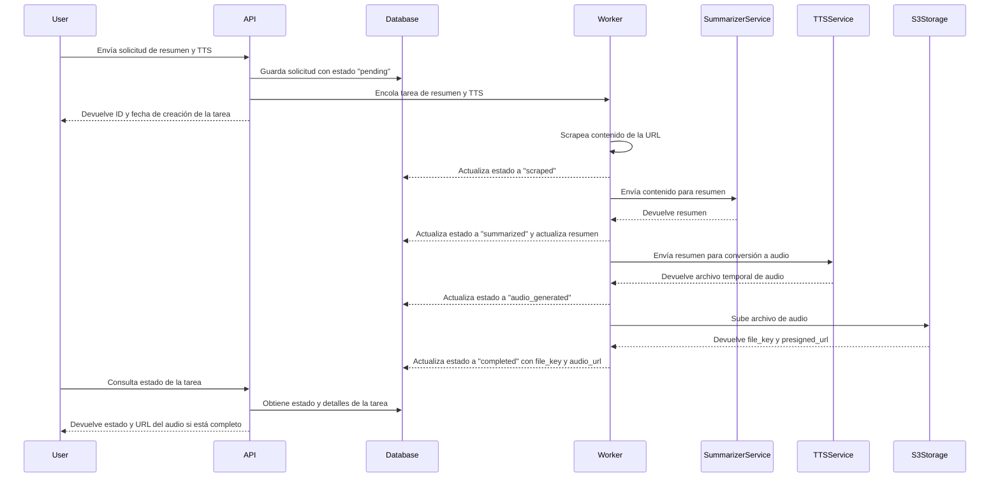

# Text-To-Speech Summarizer API

Una API RESTful para generar resúmenes de artículos y convertirlos a audio usando modelos de lenguaje e inteligencia artificial.

## Tabla de contenidos

1. [Descripción](#descripción)
2. [Características](#características)
3. [Tecnologías](#tecnologías)
4. [Instalación](#instalación)
5. [Uso](#uso)
6. [Endpoints](#endpoints)
7. [Casos de uso](#casos-de-uso)
8. [Arquitectura del sistema](#arquitectura-del-sistema)
9. [Componentes principales](#componentes-principales)
10. [Estructura del proyecto](#estructura-del-proyecto)
11. [Notas técnicas](#notas-técnicas)
12. [Licencia](#licencia)

## Descripción

Este proyecto proporciona una API capaz de:

- Extraer el contenido principal de un artículo desde una URL.
- Generar un resumen preciso en el idioma original del texto.
- Convertir dicho resumen en un archivo de audio (TTS).
- Almacenar el resultado para su posterior descarga.

## Características

- Extracción automática de contenido web
- Resumen de artículos con LLMs
- Conversión de texto a voz (TTS)
- API RESTful con FastAPI
- Procesamiento asíncrono con Celery + Redis
- Almacenamiento de archivos en S3
- Despliegue con Docker y Docker Compose

## Tecnologías

- Python 3.10+
- FastAPI
- Pydantic
- Celery + Redis
- Docker & Docker Compose
- Amazon S3
- Gemini API
- ElevenLabs

## Instalación

```bash
git clone https://github.com/javier-fraga-garcia/tts-summarizer-api.git
cd tts-summarizer-api
cp .env.template .env

# Configura variables de entorno en .env

docker-compose up --build
```

## Uso

Con la API en ejecución, puedes consultar la documentación interactiva disponible en `http://localhost:PORT/docs`.

Si lo prefieres, también puedes utilizar el archivo `api.http` incluido para realizar pruebas directamente desde tu editor.

## Endpoints

| Método | Endpoint                      | Descripción                                                          |
| ------ | ----------------------------- | -------------------------------------------------------------------- |
| POST   | `api/jobs/`                   | Crea una nueva tarea de resumen y TTS                                |
| GET    | `api/jobs/{job_id}/status`    | Consulta el estado de una tarea por su ID                            |
| GET    | `api/jobs/{job_id}/completed` | Obtiene toda la información del trabajo cuando este se ha completado |
| GET    | `/healthcheck`                | Verifica que la API esté operativa                                   |

## Casos de uso

- **Asistentes virtuales**: integración en sistemas de voz o chat para ofrecer resúmenes auditivos de artículos.

- **Accesibilidad**: conversión y síntesis automatizada de texto a audio para optimizar la experiencia de usuarios con discapacidad visual o dificultades lectoras.

- **Monitorización de medios**: generación de resúmenes sonoros de artículos relevantes para analistas, periodistas o departamentos de comunicación.

## Arquitectura del sistema

A continuación se muestra un diagrama de alto nivel de la arquitectura del sistema, diseñado para facilitar la comprensión de los componentes y su interacción dentro del proyecto.



## Componentes principales

### FastAPI (API REST)

Framework backend moderno que expone los endpoints. Gestiona validación, documentación y encola las tareas.

### Celery + Redis (Task Queue)

Celery maneja la ejecución asíncrona de tareas. Redis actúa como broker para encolar y distribuir las tareas entre los workers. Esto permite que la ejecución de tareas pesadas no bloquee la API y mejora la escalabilidad.

### Gemini API (Resumen)

Servicio de terceros que proporciona capacidades avanzadas de resumen de texto. Se encarga de procesar el contenido extraído y generar un resumen coherente.

### ElevenLabs (TTS)

Servicio de conversión de texto a voz que transforma el resumen generado en un archivo de audio. Permite personalizar la voz y el estilo de la síntesis.

### Amazon S3 (Almacenamiento)

Almacena los archivos de audio generados. Proporciona alta disponibilidad y escalabilidad para manejar grandes volúmenes de datos.

### Docker (Contenerización)

Permite empaquetar la aplicación y sus dependencias en contenedores, facilitando el despliegue y la portabilidad entre entornos.

## Estructura del proyecto

```bash
api.http                # Archivo para pruebas de endpoints
compose.yml             # Docker Compose para servicios
Dockerfile              # Imagen Docker para la API
README.md               # Documentación del proyecto
requirements.txt        # Dependencias Python
.env.template           # Ejemplo de variables de entorno
src/
├── core/               # Configuración y utilidades centrales
├── db/                 # Conexión y manejo de base de datos
├── models/             # Modelos ORM
├── routes/             # Rutas y controladores FastAPI
├── schemas/            # Esquemas para validación y serialización
├── worker/             # Tareas Celery y configuración del worker
│   ├── __init__.py     # Inicialización del paquete
│   ├── celery_app.py   # Configuración de Celery
│   └── tasks/          # Definición de tareas asíncronas
├── main.py             # Punto de entrada principal de la API

```

## Notas técnicas

- Los resúmenes respetan el idioma original del contenido.

- Toda tarea intensiva se ejecuta fuera del hilo principal de la API.

- Configuración flexible mediante variables de entorno.

## Licencia

Este proyecto está bajo la licencia MIT.

Consulta el archivo [LICENSE](./LICENSE) para más detalles.
